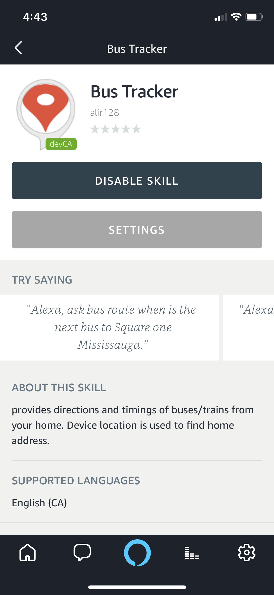
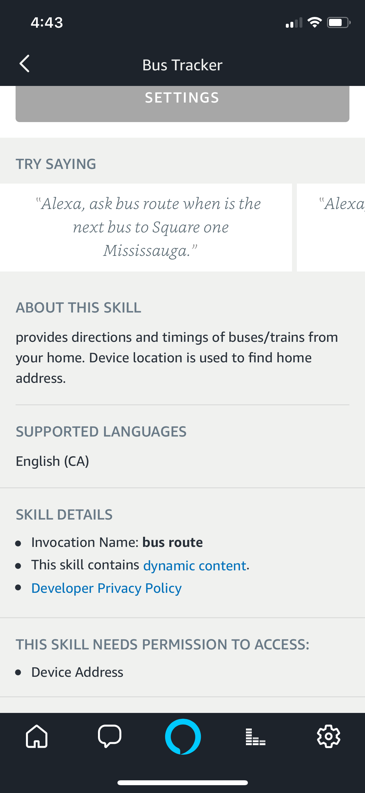

BusTracker
==========

Bus Tracker built for Amazon Alexa

Deployed as dev project on my personal alexa device. Uisng Google Maps api and
alexa skills kit I developed this application in Fall 2017, during the season
when Alexa was being introduced in Canadian English, to be supported in Canada.
The application is made to only work in Canada for now due to different Slots
and Intents in Canadian English and other languages.

 

Few tweaks are still required to make the application pass Amazon verification
and to be made publicly available for Canadian customers.

